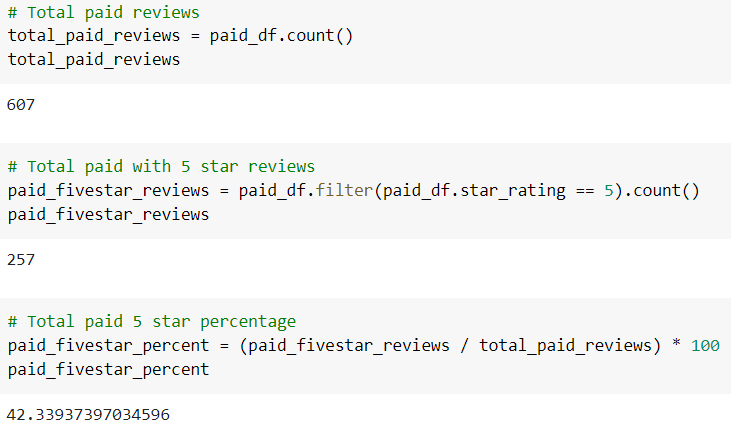
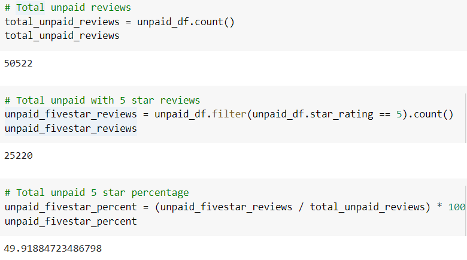

# Amazon_Vine_Analysis

## Overview of Analysis:

The purpose of the Amazon Vine analysis is to analyze Amazon review wirtten by members of the paid Amazon Vine program. The Amazon Vine program is a service that allows manufacturers and publishers to receive reviews for their products. The dataset that was chosen was Camera product reviews. The objective was to from an ETL process to extrat the dataset from the website, transform the data into dataframes using PySpark, connect to an AWS RDS instance, and load the transformed data into pgAdmin. This was completed by using PySpark on Google Colab, AWS RDS , and pgAdmin's SQL to complete the project. 

## Results
### Amazon Vine Paid Results

### Amazon Vine Unpaid Results

### Summary

The outcome was fairly suprising considering a paid incentive resulted in 42% of the total paid reviews to be 5-star where as the non-paid reviews resulted in 49% of the total unpaid reviews being 5-star. This points to a non-bias or non-existant relationship on paid versus non-paid and that the paid program does not bring you more positive reviews. This test could be further examined buy reviewing the total average score of paid versus non-paid and analyzing that outcome. There are a lot of variables that could be at play, only a further analysis could provide a more accurate image if the paid program does give a bias or not.
